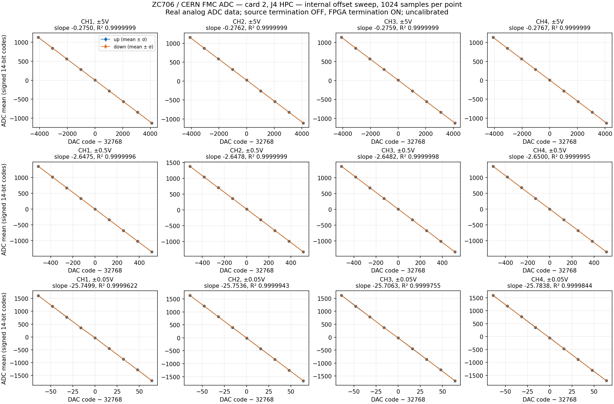

# Dwie karty CERN FMC ADC na ZC706

Status 2026-10-09: **akwizycja z obu fizycznych kart PASS**. Test obu kart
równolegle sprawdził 278528 wartości kanałów wzorców oraz dwa snapshoty po
1024 próbek na kanał. Osobne treningi IDELAY/BITSLIP przeszły; synchronizacja
między kartami pozostaje późniejszym etapem. Wyniki obu kart i bootu:
`evidence/zc706/adc-dual-20261009/`. Wcześniejszy build i symulacje:
`evidence/zc706/adc-dual-20261008/`.

Element | Status
---|---
Yosys → nextpnr/openXC7 → bitstream | PASS, 22 pary z DIFF_TERM
Timing 100/200/400 MHz | PASS
Symulacja dwóch zegarów i izolacji resetów/buforów | PASS
AXI/CSR obu kart w syntetyzowanym SoC | PASS
Boot fizycznej ZC706, Linux i Ethernet/SSH | PASS na bitstreamie dwóch kart
Karta LPC: 34 wzorce i snapshot 1024 próbek | PASS, 139264 wartości kanałów
Fizyczny zapis/odczyt CSR HPC, izolacja tapów LPC | PASS
Fizyczny odbiór ADC z HPC | PASS: 34 wzorce i snapshot 1024 próbek
Synchronizacja kart / ADC → DDR | późniejszy etap

Finalny bitstream SHA-256:
`ab7c43cd661a61b43dc35e4a299bd3cad9a75492a85febe9e88a16197f5f9560`.
Po testach obie karty mają `control=1`, `ssr=0`; wszystkie tappy HPC
przywrócono po próbie zapisu/odczytu z 8 października. Obie fizyczne karty
uruchomiono i przetestowano równolegle 9 października.

## Hardware i architektura

Karta 1: **J5 LPC**, sprawdzona wcześniej CERN FMC ADC 100M 14b 4cha v6.1.
Karta 2: **J4 HPC**, wykorzystujemy tylko sygnały części LA.
Wszystkie użyte piny obu złączy są HR: LPC banki 10/12, HPC banki 11/13.
DCO HPC jest na AF20/AG20, parze SRCC w banku 11; frame AG21/AH21.
Źródło: istniejący audyt schematu ZC706 i mapy CERN
`evidence/zc706/fmc-adc-pin-audit-20261007.json`.
Pełna mapa 130 różnych pinów jest w `evidence/zc706/adc-dual-20261008/pinmap.csv`.

VADJ musi wynosić **2.5 V**; odbiorniki używają LVDS_25 i wewnętrznej terminacji
FPGA HR, sterowanie LVCMOS25. Podłączaj FMC przy wyłączonej płycie.
Terminacja źródłowa ADC jest wyłączana przez A2=0 dla każdej karty.
Nie utożsamiaj tej terminacji z osobną terminacją analogową 50 Ω.

Każda karta ma własny Si570, DCO 400 MHz, MMCM, zegar próbek 100 MHz,
ISERDES/IDELAY/BITSLIP, trening dziewięciu linii oraz BRAM 1024 × 64 bity.
Wspólne są PS/AXI/CSR 100 MHz i referencja IDELAY 200 MHz.
Oba snapshoty mogą trwać równolegle, lecz **nie mają wspólnej epoki ani
zagwarantowanej zgodności fazy**. Nie sklejamy ich w pozornie synchroniczne
wiersze ośmiu kanałów. Synchronizacja i transfer do DDR PL są późniejszymi etapami.

Pierwsze banki i istniejące adresy rejestrów pozostają zgodne z targetem LPC.
Dodany na końcu banku identyfikator `card_id` pozwala wykryć niezgodność
załadowanego gateware z mapą CSR przed sterowaniem ADC.

Bank | Baza | Zastosowanie
---|---|---
probe | 0x40000800 | istniejąca sygnatura i scratch
adc | 0x40001000 | karta 1 LPC
adc_spi | 0x40001800 | SPI ADC/DAC karty 1
adc_i2c | 0x40002000 | Si570 karty 1
board_i2c | 0x40002800 | istniejące sterowanie magistralą płyty
adc2 | 0x40003000 | karta 2 HPC
adc2_spi | 0x40003800 | SPI ADC/DAC karty 2
adc2_i2c | 0x40004000 | Si570 karty 2

`adc_card_id=0xadc00001`, `adc2_card_id=0xadc00002`.
Pełną mapę generuje LiteX w `build/zc706-adc-dual/gateware/csr.json`.
Obie karty startują z resetem odbiornika, wyłączonym OE oscylatora,
aktywnym DAC CLR oraz odłączonymi wejściami analogowymi.

## Odtworzenie

Zależności i przypięte upstreamy jak w głównym README; bez Vivado:

```sh
make bootstrap BOARD=zc706
make adc-dual-package
```

`adc-dual-package` wykonuje Yosys → nextpnr/openXC7 → X-Ray → bitstream,
symulacje odbiornika, snapshotów i AXI/CSR, a potem tworzy
`build/zc706-adc-dual/zc706-fmc-adc-dual.tar.xz` z sumami SHA-256.
Build wymaga emisji dokładnie **22** par terminowanych LVDS, po 11 na kartę.
Nakładki bazy pinów i DIFF_TERM są współdzielone z istniejącym targetem ADC;
oryginalny backend i target DDR pozostają osobne.

## Boot przez SD bez JTAG

Sprawdzona fizycznie alternatywa, gdy USB JTAG nie ma uprawnień:

```sh
python3 tools/boot_adc_jtag.py --sd --host 192.168.2.9 \
  --bit build/zc706-adc-dual/gateware/gateware/top.bit \
  --output build/zc706-adc-dual/hardware/boot-sd
```

Opcja `--sd` dodaje plik `/root/adc-<SHA256>.bit` do istniejącego rootfs ext4
na SD, sprawdza jego SHA-256, wykonuje sync i restart Linuksa. Zatrzymuje
U-Boot przez UART i wykonuje `ext4load mmc 0:2` oraz `fpga loadb`.
Nie zmienia domyślnych plików bootujących, QSPI ani trwałego środowiska U-Boot.
W tym trybie **zapisujemy nowy plik na SD**; domyślny tryb JTAG nie zapisuje SD.
Minimalny kernel nie ma VFAT, dlatego loader korzysta z ext4 zamiast FAT.
Zwykły restart nadal wraca do dotychczasowego domyślnego obrazu.

## Bring-up po podłączeniu drugiej karty

Nie programuj PL przez JTAG podczas dostępu Linuksa do GP0. Dotychczasowy
loader synchronizuje filesystem, resetuje PS, zatrzymuje U-Boot, wgrywa
bitstream do SRAM i uruchamia istniejącego Linuksa z SD:

```sh
python3 tools/boot_adc_jtag.py --host 192.168.2.9 \
  --bit build/zc706-adc-dual/gateware/gateware/top.bit \
  --output build/zc706-adc-dual/hardware/boot
```

Adres po restarcie odczytaj z UART; `.9` jest przykładem ostatniego adresu.
Loader nie zapisuje SD, QSPI ani środowiska U-Boot. Powrót do poprzedniego
bitstreamu przez ten sam loader lub zwykły restart do dotychczasowego obrazu SD.

Test samego HPC:

```sh
python3 tools/test_adc_hardware.py --host 192.168.2.9 --card 2 \
  --bit build/zc706-adc-dual/gateware/gateware/top.bit \
  --csr-json build/zc706-adc-dual/gateware/csr.json \
  --output build/zc706-adc-dual/hardware/card2
```

Test obu kart równolegle:

```sh
python3 tools/test_adc_dual_hardware.py --host 192.168.2.9
```

Każdy proces ma osobny katalog na Linuksie i własny bank CSR. Test sprawdza
SPI, Si570, częstotliwość próbkowania, automatycznie dobiera IDELAY/BITSLIP,
sprawdza 34 wzorce po 1024 próbek × 4 kanały i wykonuje snapshot danych ADC.
Łącznie są to 278528 wartości kanałów wzorców oraz dwa niezależne snapshoty.
Wyjścia: `hardware/card1/` i `hardware/card2/`, osobne JSON/CSV/binary/logi.
Test nadrzędny raportuje PASS tylko po sukcesie obu kart.
Każdy test odłącza SSR i zatrzymuje swoją kartę w bloku `finally`.

Do pojedynczej akwizycji po skopiowaniu `fmc_adc.py` i `csr.json` na płytę:

```sh
python3 fmc_adc.py --csr-json csr.json --device /dev/uio0 \
  --card 2 --range 5V --output hpc-capture
```

Domyślny zakres `open` odłącza wejścia BNC. Opcja `5V` je dołącza;
terminacja analogowa 50 Ω pozostaje wyłączona. Dane są nieskalibrowanymi
kodami ADC, nie pomiarem napięcia z potwierdzoną dokładnością.
Ten program również wykonuje trening i test wzorców przed snapshotem.

## Walidacja i granice

Symulacja dwóch asynchronicznych zegarów obejmuje równoległe snapshoty,
przerwanie i ponowne uzbrojenie HPC podczas pracy LPC, dokładne porównanie
2048 próbek i zamrożenie obu buforów. Test syntetyzowanego SoC sprawdza
oddzielność banków CSR, dziewięciu tapów i resetów przez rzeczywisty most AXI.
Model SPI i rzeczywisty adapter MMIO sprawdzają wybór karty bez zapisów do
banku drugiej karty oraz odrzucenie nieobecnej karty przed dostępem do urządzenia.
To nie zastępuje pomiaru oka i testów fizycznego HPC.

Brak transferu ADC → DDR, synchronizacji kart, ciągłego streamingu oraz
fizycznego potwierdzenia zewnętrznego triggera. Build nadal obejmuje tylko
snapshoty BRAM. W pełni synchroniczne osiem kanałów wymaga późniejszej pracy.

## Fizyczny tor analogowy HPC — offset DAC

2026-10-09: karta HPC przeszła również sweep czterech offsetów na wszystkich
trzech zakresach. Każdy zakres: 76 snapshotów × 1024 próbki × 4 kanały,
łącznie **933888 wartości kanałów**. Zmiany były monotoniczne, bez clippingu
oraz błędów frame; ADC pracował z wyłączonym generatorem wzorców.

Zakres | CH1 | CH2 | CH3 | CH4
---|---|---|---|---
±5 V | -0.27495 | -0.27624 | -0.27585 | -0.27675
±0.5 V | -2.64747 | -2.64784 | -2.64822 | -2.65001
±50 mV | -25.74987 | -25.75361 | -25.70634 | -25.78382

Wartości w tabeli: nachylenie w kodach ADC na kod DAC, **bez kalibracji napięcia**.
To potwierdzenie wewnętrznego toru offset → ADC, nie pełna charakterystyka BNC,
szumów, ENOB ani pasma. Zewnętrzny generator i synchronizacja kart nadal później.



JSON/CSV i surowe snapshoty:
`evidence/zc706/adc-dual-20261009/offset-hpc/`.
Odtworzenie testu na załadowanym bitstreamie dwóch kart:

```sh
python3 tools/test_adc_offset_hardware.py --host 192.168.2.9 --card 2 \
  --build-dir build/zc706-adc-dual/gateware \
  --output build/zc706-adc-dual/hardware/offset-hpc
```

Test przywraca zapisaną konfigurację tapów, zeruje offsety poleceniem 0x8000,
odłącza SSR i zatrzymuje odbiornik. Niezależny odczyt po testach obu kart:
`final-state.json` — `control=1`, `ssr=0`, ADC A2=0 i A3=0 na obu kartach.
