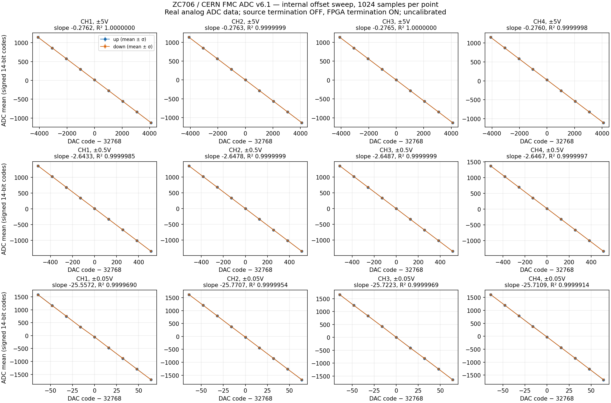

# Fizyczny test offsetu FMC ADC

2026-10-08: **PASS dla wszystkich czterech kanałów i trzech zakresów**.
ZC706 rev. 1.2 / CERN FMC ADC100M14b4cha v6.1 w J5 LPC, VADJ 2.5 V.
Terminacja FPGA ON, terminacja źródła ADC OFF (`A2=0`). Nie zmieniano
bitstreamu, SD, QSPI, EEPROM ani konfiguracji zegara.

Test używa rzeczywistego wejścia analogowego ADC: cyfrowy wzorzec jest
wyłączony. Źródłem zmian jest wewnętrzny DAC offsetu karty; nie podłączono
zewnętrznego generatora. Potwierdza to tor DAC offsetu → analog → ADC →
ISERDES → BRAM → Linux, ale nie pełną charakterystykę wejścia BNC.

## Sterowanie zgodne z CERN

`kernel/fa-calibration.c::fa_dac_offset_set` z przypiętego upstreamu wysyła
16-bitowe słowo SPI do osobnego chip-select każdego kanału. `0x8000` to
nominalne zero, format offset binary. Driver udostępnia teraz:

```python
adc.set_offset_code(0, 0x8000)  # kanał 1; indeksy kanałów 0..3
```

Nie ma readbacku DAC: potwierdzeniem zapisu jest odpowiedź ADC. Nie używano
współczynników fabrycznej kalibracji z EEPROM i nie przypisujemy kodom DAC
zwalidowanych wartości napięcia.

Zakresy SSR pochodzą z `kernel/fa-core.c::zfad_hw_range`: `0x45`, `0x11`,
`0x23`. Terminacja 50 Ω wejścia analogowego pozostaje wyłączona.
To osobny element od terminacji LVDS FPGA/ADC.

## Przebieg i wynik

Każdy kanał był sterowany osobno; inne DAC-i pozostały na `0x8000`.
Dla każdego zakresu wykonano dziewięć punktów w górę, dziewięć w dół
oraz pomiar po powrocie do zera. Każdy snapshot zawiera 1024 próbki wszystkich
czterech kanałów. Przerwa po zmianie DAC wynosi 50 ms. Łącznie 228 snapshotów,
**933888 wartości kanałów**; bez błędów frame i bez obcięcia na szynach ADC.

| Nominalny zakres | Rampa DAC względem 32768 | Nachylenie CH1 / CH2 / CH3 / CH4, kod ADC/kod DAC | Najmniejsze R² |
|---|---|---|---|
| ±5 V | ±4096 | −0.27622 / −0.27628 / −0.27651 / −0.27602 | 0.99999980 |
| ±0.5 V | ±512 | −2.64332 / −2.64776 / −2.64869 / −2.64666 | 0.99999854 |
| ±50 mV | ±64 | −25.55717 / −25.77074 / −25.72228 / −25.71089 | 0.99996900 |

Reakcja jest monotoniczna na każdym kanale. Zwiększanie kodu DAC obniża
kod ADC. Zmiana zakresu zwiększa nachylenie około 9.6×, a następnie 9.7×;
nie jest to dowód dokładnego, skalibrowanego wzmocnienia 10×.
Największe zmiany średniej innych kanałów podczas rampy jednego DAC wyniosły
0.79 / 1.87 / 9.73 kodu ADC odpowiednio dla zakresów ±5 V / ±0.5 V / ±50 mV.
To obserwacja ze snapshotów DC, nie pomiar przesłuchu AC.



Wykres pokazuje średnią ± odchylenie standardowe pojedynczego snapshotu.
Wyniki i CSV: `evidence/zc706/adc-offset-20261008/`. Archiwum
`raw-snapshots.tar.xz` zawiera wszystkie surowe próbki; sprawdzono ich SHA-256
i rozmiary względem manifestu. Kolejność próbek binarnych
opisują `sample_offset` i `samples` każdego rekordu w JSON. Każda próbka
zawiera cztery little-endian uint16, ze signed 14-bit ADC wyrównanym do MSB
(`signed16 // 4`).

Na końcu zapisano `0x8000` do wszystkich DAC-ów, odłączono wejścia przez SSR,
przywrócono początkowe IDELAY i zatrzymano odbiornik/oscylator. Kontrolny odczyt
potwierdził `adc_control=1`, `adc_ssr=0`, `ADC A2=0`, `ADC A3=0`.
Stan ten ma też aktywny DAC CLR. Nie twierdzimy, że odczytano kody DAC.

## Odtworzenie

Na działającej ZC706 z bieżącym bitstreamem HR termination i SSH:

```sh
python3 tools/test_adc_offset_hardware.py --host ADRES_IP
```

Domyślnie testuje wszystkie trzy zakresy. Na samej płycie:

```sh
python3 test_adc_offset.py --csr-json csr.json --range 5V --half-span 4096
```

Test wymaga znanego stanu początkowego: zatrzymany odbiornik, wejścia odłączone,
DAC CLR aktywny (`control=1`, `SSR=0`). Przywraca ten stan w `finally`, także
przy błędzie pomiaru. Nie reprogramuje FPGA i nie zapisuje kalibracji EEPROM.
Ponowny test cyfrowych wzorców: `python3 tools/test_adc_hardware.py --host ADRES_IP`.

Opcjonalne odtworzenie wykresów, w odseparowanych zależnościach:

```sh
python3 tools/environment.py build/python/bin/python -m pip install \
  --target build/adc-plot-deps \
  -r evidence/zc706/adc-offset-20261008/plot-requirements.txt
python3 tools/environment.py build/python/bin/python tools/plot_adc_offset.py \
  evidence/zc706/adc-offset-20261008/5V-result.json \
  evidence/zc706/adc-offset-20261008/0.5V-result.json \
  evidence/zc706/adc-offset-20261008/0.05V-result.json \
  --output build/zc706-adc/offset-response
```

Następny test analogowy wymaga znanego zewnętrznego sygnału, a następnie
kalibracji napięcia, pomiaru szumu i charakterystyki częstotliwościowej.
Połączenie ADC z DDR PL nadal pozostaje osobnym, niezrealizowanym etapem.
