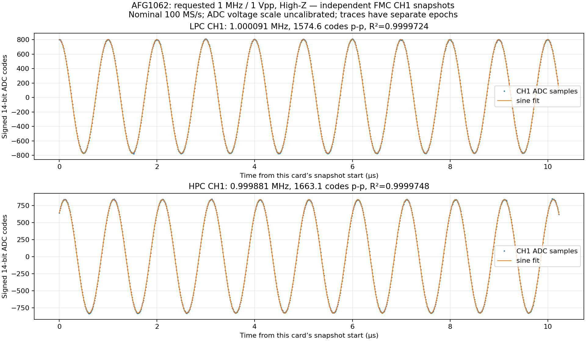

# ZC706 / obie FMC / Tektronix AFG1062

2026-10-09: przygotowane przechwycenie CH1 obu kart. **Pomiar zadanego
sinusa 1 MHz / 1 Vpp nie został jeszcze wykonany** — generator nie został
przestawiony, brak dostępu SSH/API do Pi mostu.

Pi rozpoznane przez odpowiedź mDNS PTR: `RPI-USBTMC.local`,
`192.168.2.36`, MAC `b8:27:eb:01:74:4d`. SSH odpowiada, most nie słucha
na standardowych portach. Pi `192.168.2.8` to osobny projekt RNG.
ZC706: po przywróceniu huba i linku Ethernet `192.168.2.10`.

Bitstream dwóch kart załadowany ponownie z istniejącego pliku ext4 przez
UART/U-Boot, bez JTAG, bez zapisu SD/QSPI i bez SSH:

```sh
python3 tools/boot_adc_jtag.py --sd-existing --allow-no-network \
  --bit build/zc706-adc-dual/gateware/gateware/top.bit
```

Wymaga zalogowanej konsoli root Linuksa oraz istniejącego
`/root/adc-<SHA256>.bit`; loader weryfikuje SHA-256 przed restartem.
`--allow-no-network` potwierdza tylko działający shell UART, nie DHCP.
Standardowy tryb loadera pozostaje bez zmian.

Skrypt przechwycenia na płytę: `tools/capture_adc_sine.py` wraz z
`tools/fmc_adc.py` i wygenerowanym `csr.json`. Każda karta ma osobny trening,
ADC generator wzorców zostaje wyłączony, tylko CH1 dołączony na zakresie
±5 V, analogowe 50 Ω wyłączone. Cztery snapshoty po 1024 próbek na kanał,
RAW BIN i CSV, bez założenia wspólnej fazy między kartami.

```sh
python3 capture_adc_sine.py --csr-json csr.json --output capture
```

Skrypt wymaga początkowego `control=1`, `ssr=0` na obu kartach. Po pomiarze
odłącza wejścia i zatrzymuje odbiorniki. Nie steruje generatorem i nie
uznaje samego odczytu próbek za potwierdzenie częstotliwości/amplitudy.

Próbny odczyt obu kart PASS bez błędów frame, ale na wejściach nie było
zadanego przebiegu. Pierwsze snapshoty CH1: LPC −2..21 kodów ADC,
HPC −6..15 kodów ADC. To **baseline bez potwierdzonych nastaw generatora**,
nie pomiar sinusa ani charakterystyka szumów. Zapis:
`evidence/zc706/afg-bringup-20261009/`.

Do kontynuacji potrzebny login SSH do `RPI-USBTMC.local` albo dostępna usługa
mostu z konfiguracją klienta. Zakładamy sinus 1 MHz, 1 Vpp, offset 0 V;
obciążenie AFG trzeba odczytać/ustawić jawnie dla wejść wysokiej impedancji.

## Sinus AFG — pomiar fizyczny PASS

Po udostępnieniu dostępu do Pi wykonano pomiar, wyniki są w
`evidence/zc706/afg-sine-1mhz-20261009/`. Wcześniejszy baseline i jego blokada
pozostają zapisane jako historia — nie są wynikami tego pomiaru.

Most był w pętli restartów: konfiguracja nasłuchu nadal wskazywała nieobecny
adres `192.168.2.16`. Zapisano kopie starej konfiguracji i certyfikatu na Pi,
zmieniono nasłuch na `.36`, wystawiono certyfikat dla aktualnego adresu z
istniejącym kluczem i uruchomiono usługę. Token i selektory USB pozostały te same.
Certyfikat publiczny został pobrany przez SSH, klient sprawdza TLS i Bearer token.
Klucz prywatny i dane logowania **nie są w repo**.

AFG zidentyfikowany: `TEKTRONIX,AFG1062,1544477,SCPI:99.0 FV:V1.0.1`.
Oba wyjścia: SIN, CW, 1 MHz, zadane 1 Vpp, offset 0 V, obciążenie High-Z.
Readback amplitudy CH1: 1.001 Vpp, CH2: 1.000 Vpp. Oba wyjścia ON.
Analogowa terminacja 50 Ω FMC pozostaje OFF, dołączony tylko CH1 każdej karty.

Karta CH1 | Częstotliwość dopasowania, snapshot 0 | Amplituda ADC | Nominalne Vpp | R²
---|---|---|---|---
LPC | 1.000091 MHz | 1574.63 kodów p-p | 0.96108 Vpp | 0.99997245
HPC | 0.999881 MHz | 1663.09 kodów p-p | 1.01507 Vpp | 0.99997475

Cztery snapshoty na kartę, każdy 1024 próbek/kanał. Wszystkie przeszły:
zero błędów frame, brak clippingu i R² > 0.9999. BIN zachowuje oryginalne
16-bitowe słowa; CSV zawiera podpisane 14-bitowe kody.



Dopasowanie zakłada **nominalne 100 MS/s**. Napięcie jest tylko przeliczeniem
kodów przez nominalne 10 V / 16384; nie wykorzystuje kalibracji EEPROM.
Różnica amplitudy kart wymaga późniejszej kalibracji, nie korekty danych tego testu.
To nie jest pomiar ENOB ani potwierdzenie dokładności częstotliwości na poziomie ppm.
Snapshoty mają osobne początki czasu; ich faz nie można traktować jako zsynchronizowanych.

Firmware AFG v1.0.1 zwraca po `OUTP:IMP?` także nie-ASCII symbol Ω;
skrypt zapisuje surowe bajty i poprawnie odczytuje liczbową wartość High-Z.
Nie obsługuje `VOLT:UNIT VPP`; używamy polecenia amplitudy `SOUR:VOLT` właściwego
AFG1000. Zaobserwowany readback 1.001 Vpp dla zadanych 1 Vpp dopuszczamy
z tolerancją 2 mV; nie przypisujemy tej różnicy kalibracji ADC. Źródło komend:
[Tektronix AFG1000 Programmer Manual](https://download.tek.com/manual/AFG1000-Programmer-Manual-EN-077112902.pdf).

Konfiguracja generatora z checkoutu (sekrety tylko w lokalnych plikach):

```sh
python3 tools/configure_afg_sine.py \
  --lab-repo /home/codex-hil/lab-instruments \
  --url https://192.168.2.36:8840 \
  --token-file /path/to/gateway.token --ca-file /path/to/gateway-ca.crt \
  --output build/zc706-afg/sine-1mhz
```

Następnie `capture_adc_sine.py` na ZC706, jak wyżej. Do analizy/wykresów
używamy izolowanych, przypiętych zależności dotychczasowych wykresów offsetu:

```sh
python3 tools/environment.py python3 -m pip install \
  --target build/adc-plot-deps \
  -r evidence/zc706/adc-offset-20261008/plot-requirements.txt
python3 tools/environment.py python3 tools/analyze_adc_sine.py \
  build/zc706-afg/sine-1mhz/capture --output build/zc706-afg/sine-1mhz/analysis
python3 tools/environment.py python3 tests/adc_sine_analysis_test.py
```

Test analizy sprawdza ekstrakcję częstotliwości/amplitudy/DC z zaszumionego
sinusa i odrzucenie braku sygnału, szumu, złej częstotliwości oraz clippingu.
Po pomiarze oba odbiorniki zatrzymano i SSR odłączono; wzorce ADC są OFF.
**Generator pozostawiono na zadanym sinusie, oba wyjścia ON.**
