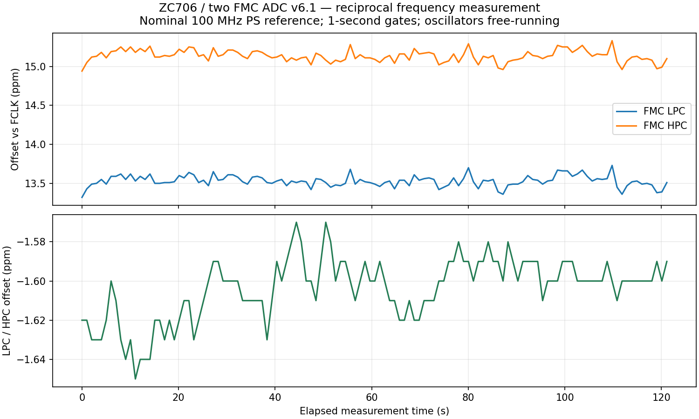

# Reciprocal FMC clock measurement and the WR PLL path

The first stage measures each FMC ADC's recovered 100 MHz sample clock
independently. It does not tune either oscillator or align sample phases.
Physically validated on ZC706 rev. 1.2 on 2026-10-10. Both the initial
complete-receiver version and the small clock-only development target pass.

## Architecture

`FMC Si570 -> LTC2174 DCO (400 MHz) -> two-bit /4 prescaler -> 100 MHz clock`
feeds one reciprocal counter per card in the small development target. The
initial full-receiver target instead uses each existing receiver MMCM output. A third counter measures the reference
against itself as an exact-ratio implementation check. The reference in this
initial target is PS FCLK0 / explicit system BUFG, nominally 100 MHz, sourced
by the existing ZC706 PS configuration. Its absolute frequency has not been
calibrated; all reported ppm values are relative to that clock.

Each measured domain counts exactly **N** sample-clock periods between two
events. Two-stage event synchronizers transfer the start/end toggles into the
reference domain, where a free-running 32-bit counter timestamps them:

`f_measured = N * f_reference / (end_timestamp - start_timestamp)`

Timestamp subtraction is modulo 2^32. The gate is limited to 16..200,000,000
cycles and a 300,000,000-reference-tick watchdog prevents an ambiguous wrap.
At nominal ADC frequency, a 100,000,000-cycle gate lasts one second and one
reference tick corresponds to approximately **0.01 ppm / 1 Hz**. This is
quantization resolution, not calibrated accuracy. Synchronizer boundary
quantization, jitter and physical routing delay affect the result. Simulation
allows two reference ticks of boundary error; metastability is not simulated.

A gate-length bus is held constant across the measurement. The measured
endpoint waits four extra cycles after the synchronized request before reading
it. No running binary counter crosses a clock domain. Results remain latched
until the next completion, and software checks status and sequence numbers.
An overlapping start is ignored. Invalid gates and lost clocks latch an error
and require software reset. Reset asserts asynchronously in the measured
domain, including when its clock is stopped, and releases synchronously there.

## Reproduce

```sh
make frequency-sim
make frequency-pl
.venv/bin/python tools/boot_adc_jtag.py --host BOARD_IP --sd \
  --bit build/zc706-frequency-small/gateware/gateware/top.bit \
  --output build/zc706-frequency-small/boot
# Use the actual DHCP address reported by the boot helper.
python3 tools/measure_fmc_clocks.py --host BOARD_IP --samples 120 \
  --test-clock-loss --output build/zc706-frequency-small/hardware
```

The build uses a dedicated two-card clock-only LiteX target, Yosys and the isolated
nextpnr/openXC7 backend with setup/hold checks. The diagnostic SD file is
content-addressed; default boot files, persistent U-Boot environment and QSPI
are preserved. This target has no deserializer, BRAM, FIFO, DDR, IDELAYCTRL or MMCM. Only
DCO input buffers, clock dividers, counters, PS AXI/CSR and board SPI/I2C
control remain. `make frequency-adc-pl` retains the full ADC-receiver variant
in `build/zc706-frequency` for comparison. The qualified ADC+DDR and SFP targets remain available.

The runner configures the ADC serial format so DCO is four times sample rate,
with FPGA DCO input termination on and ADC source termination off. Analog inputs remain disconnected; no offset/gain
scan is performed. Si570 registers 7..12 are read before and after the run and
must remain unchanged. The optional lost-clock test temporarily disables only
FMC1's oscillator output, checks FMC1 timeout while FMC2 completes, restores
its output, resets counters and checks measurement recovery.

Raw reference/sample counts, per-sample frequency, relative ppm and inter-card
ppm are saved in JSON and CSV, along with range, standard deviation, net drift
and a linear drift estimate. Preliminary gate checks use 1 ms, 10 ms, 100 ms
and 1 s windows. Host time labels the series; it does not determine frequency.

## CSR ABI 1

CSR banks 9, 10 and 11 are `frequency`, `frequency2` and
`frequency_reference`. Exact addresses are generated in `csr.json`.

| Register | Meaning |
| --- | --- |
| `gate` | Exact number of measured periods, latched on accepted start |
| `reset` | Hold at 1 to abort/recover; release to 0 before starting |
| `start` | Write pulse; ignored while busy or after an error |
| `signature` | `0x52464331`, diagnostic identity |
| `status` | Bit 0 busy, bit 1 valid; bits 3:2 error (1 timeout, 2 bad gate) |
| `reference_ticks` | Coherent latched elapsed reference cycles |
| `measured_cycles` | Coherent latched N |
| `sequence` | Increments on completion/error, resets on software reset |

Reset defaults asserted. Sampling is under software control; no autonomous
servo or I2C writer is active.

## Tomasz Wlostowski's WR/AFCZ reference

The relevant sources have been identified and pinned in `sources.lock.json`:

* [WR gateware, `wr_si57x_interface`](https://gitlab.com/ohwr/project/wr-cores/-/blob/0f8fbced87988254f5c9ca55c0e04585b29b485c/modules/wr_si57x_interface/wr_si57x_interface.vhd):
  explicitly authored by Tomasz Wlostowski; atomic hardware Si57x tuning via
  an RFREQ bias plus scaled tune value, preserving divider fields.
* [WR `wr_softpll_ng`](https://gitlab.com/ohwr/project/wr-cores/-/tree/0f8fbced87988254f5c9ca55c0e04585b29b485c/modules/wr_softpll_ng):
  phase-tagging and multiple reference/output channels for software PLLs.
* [WRPC AFCZ board initialization](https://gitlab.com/ohwr/project/wrpc-sw/-/blob/c3f553d267f3b8bad4f4ff6c321cf214ab09b97a/boards/afcz/board.c)
  and [`dev/si57x.c`](https://gitlab.com/ohwr/project/wrpc-sw/-/blob/c3f553d267f3b8bad4f4ff6c321cf214ab09b97a/dev/si57x.c):
  oscillator readout, factory-frequency-derived crystal calibration, RFREQ
  setup and the software/hardware control interface. The latter carries
  Tomasz's copyright attribution.

These sources are reference code, not yet instantiated or ported. Any imported
code must retain its CERN-OHL/GPL licensing, distinct from our BSD counter.
The current Linux bitbang interface can read each Si570 independently; the
next stage must implement bounded RFREQ updates, ownership arbitration,
readback/error handling and restoration of each factory setting.

Proceed one card at a time: first characterize the tuning sign/sensitivity
against this counter, then acquire frequency lock, then add a phase detector
and an appropriate auxiliary/DDMTD clock for a true PLL. A reciprocal frequency
counter alone cannot prove phase lock. After one loop is stable, replicate its
controller for the second FMC, with independent clock-domain handling and a
common reference. Sharing a reference also does not establish a common ADC
sample epoch; trigger/phase alignment needs a separate test.

## Physical results (2026-10-10)

Clock-only bitstream SHA-256:
`d1c6183a48afd83c6c3123bcf1d9f34fd1d1e50d908bf361ff8968a808dd8bad`.

Both cards passed 120 simultaneous one-second gates. The reference self-check
returned exactly N reference ticks on every measurement, including the gate
sweep. Disabling FMC1 produced its watchdog error while FMC2 completed; after
restoration and reset, both counters measured again. Si570 registers 7..12
were unchanged. No tuning or servo was enabled.

| Measurement | Mean offset | Observed range | Standard deviation | Linear drift |
| --- | ---: | ---: | ---: | ---: |
| LPC vs FCLK | +13.530350 ppm | +13.320177..+13.730189 ppm | 0.070653 ppm | -0.009011 ppm/min |
| HPC vs FCLK | +15.134229 ppm | +14.940223..+15.330235 ppm | 0.073661 ppm | -0.023637 ppm/min |
| LPC / HPC | -1.603855 ppm | -1.650022..-1.570021 ppm | 0.015556 ppm | +0.014626 ppm/min |

These are observations over two minutes, not long-term stability or phase/jitter
specifications. Correlated movement relative to FCLK cannot be attributed to
either the reference or the FMC oscillators without an independent reference.
The relative offset corresponds to approximately 160 Hz between the two
nominal 100 MHz sample clocks.



[Raw results and counts](../evidence/zc706/frequency-20261010/clock-only/result.json),
[CSV](../evidence/zc706/frequency-20261010/clock-only/samples.csv),
[timing report](../evidence/zc706/frequency-20261010/clock-only/timing.json),
[validation and resource comparison](../evidence/zc706/frequency-20261010/clock-only/hardware-validation.json).
The original receiver-based smoke test is retained in
[receiver-baseline](../evidence/zc706/frequency-20261010/receiver-baseline/).

With cached toolchains/database, place-and-route took 107.45 seconds for the
clock-only version versus 167.52 seconds for the receiver version on the same
2-CPU-limited environment. This measures routing-stage wall time, excluding
initial toolchain installation, synthesis and bitstream assembly. The small
netlist has zero BRAM/MMCM/ISERDES/IDELAY cells and two LVDS DCO inputs; the
full receiver baseline has four BRAMs, three MMCMs and 18 ISERDES/IDELAY lanes.

To regenerate the plot using the existing optional plotting dependencies:

```sh
python3 tools/environment.py build/python/bin/python -m pip install \
  --target build/adc-plot-deps \
  -r evidence/zc706/adc-offset-20261008/plot-requirements.txt
python3 tools/environment.py build/python/bin/python tools/plot_fmc_clocks.py \
  evidence/zc706/frequency-20261010/clock-only/result.json \
  --output build/zc706-frequency-small/frequency-drift
```

The board is left running the clock-only target. To restore the already
qualified ADC+DDR design from its preserved SD cache:

```sh
.venv/bin/python tools/boot_adc_jtag.py --host BOARD_IP --sd-existing \
  --bit build/zc706-adc-ddr/gateware/gateware/top.bit \
  --output build/zc706-adc-ddr/restore
```
